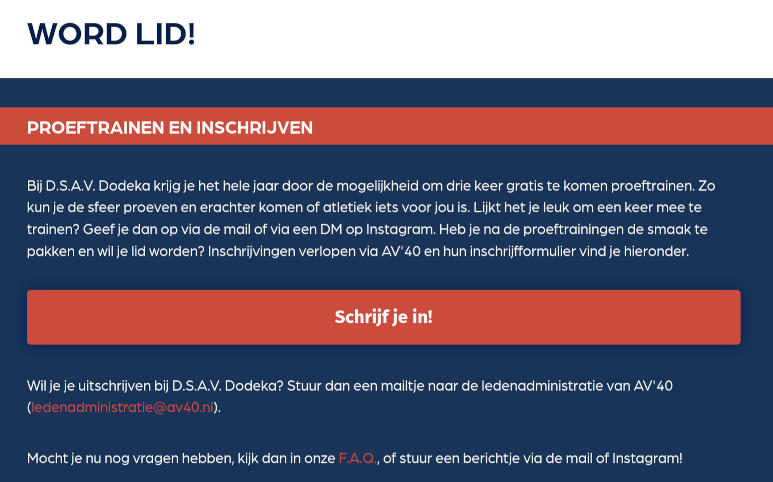
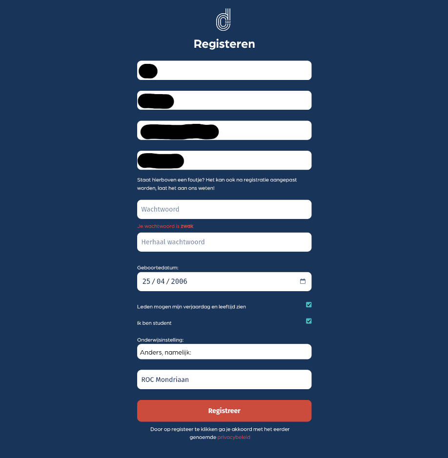
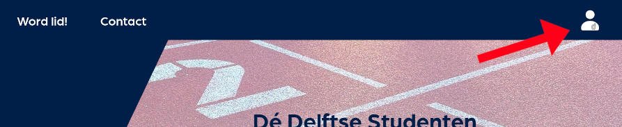

# Account aanmaken

Een account aanmaken begint bij de [Word lid!](https://dsavdodeka.nl/word_lid)-pagina op de website. 

Druk op de "Schrijf je in!" knop. Dit opent een scherm waar je wat basisinformatie aan ons kunt doorgeven. Je kunt je alleen inschrijven als je akkoord gaat met het privacybeleid, want we moeten informatie opslaan als je inschrijft bij Dodeka.

Na het invullen van je gegevens, druk je op "Schrijf je in via AV\`40". [AV\`40](https://www.av40.nl/) is onze moedervereniging. Als je lid wordt bij Dodeka, word je ook lid van AV\`40. De officiële ledenadministratie loopt ook via AV\`40, dus daarom wordt je doorverwezen naar hun [inschrijfpagina](https://www.av40.nl/index.php?page=Inschrijfformulier&sid=1).

Het is belangrijk dat je onderaan de keuze "Ik wil lid worden van DSAV Dodeka (de studentenatletiekvereniging van AV'40 Delft)" aanvinkt. 

Na het inschrijven heb je waarschijnlijk al een e-mail ontvangen van comcom@dsavdodeka.nl, met de vraag om je e-mail te bevestigen.

<!-- TODO: voeg plaatje van email toe -->

Klik op deze button om aan ons systeem te laten weten dat je e-mail klopt. Hierna zal je even moeten wachten, want het bestuur moet jouw aanmelding op onze website koppelen aan de ledenadministratie van AV\`40. Zodra zij dit hebben gedaan, zul je bericht krijgen om je officieel te registreren op onze website. Dit zal verstuurd worden naar de e-mail die je hebt opgegeven op onze website (dus niet bij AV\`40).

## Registreren

In de e-mail vind je een link om je officieel te registreren op onze website. Dit is verplicht als je wil trainen.

Je kunt toestemming verlenen om aan andere leden je verjaardag en leeftijd te laten zien. Wie weet krijg je wel een heleboel felicitiaties!

Na het drukken op "Registreer" word je doorverwezen naar de website, waar je vervolgens kunt inloggen door rechtsboven op het icoontje te drukken.

